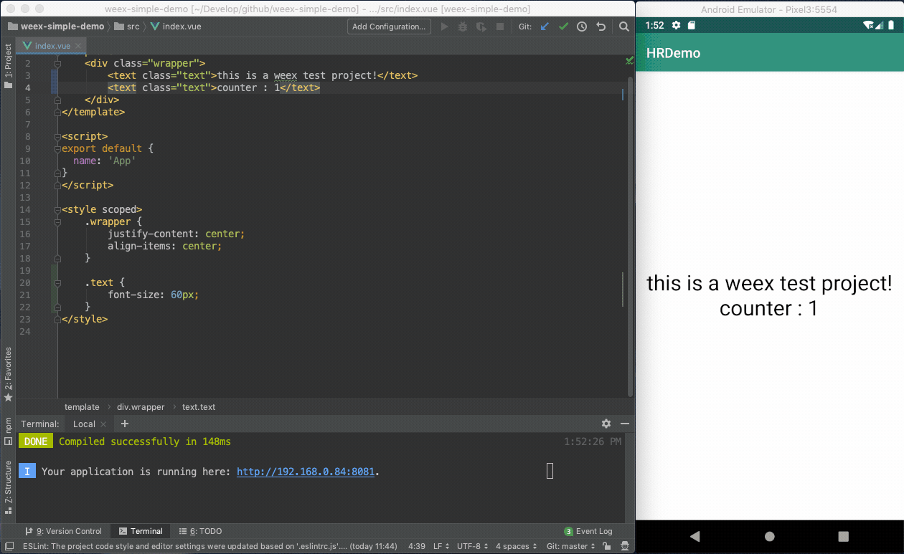
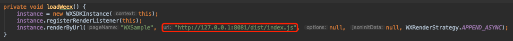

# Introduction

An android library for hot reload when the weex bundle changed in development.

# Requires

android sdk >= 14

webpack-dev-server

# Third sdk dependencies

weex_sdk >= 0.14.0.9

fastjson >= 1.1.15

okhttp >= 3.5.0 

# Usage

add the dependencies to the gradle

```
debugImplementation 'com.wayne:weex_host_reload:1.0.0'
```

# Test

1. clone and run the [weex simple demo](https://github.com/dearwayne/weex-simple-demo)

	```
	$ npm install -g weex-toolkit
	$ git clone https://github.com/dearwayne/weex-simple-demo.git
	$ cd weex-simple-demo
	$ npm install && npm start
	```
	
2. clone this project

	```
	git clone https://github.com/dearwayne/weex-hot-reload-android.git
	```
	
3. modify the weex bundle url in WeexActivity

	
	
4. run the HRDemo

5. make some changes in weex simple demo
